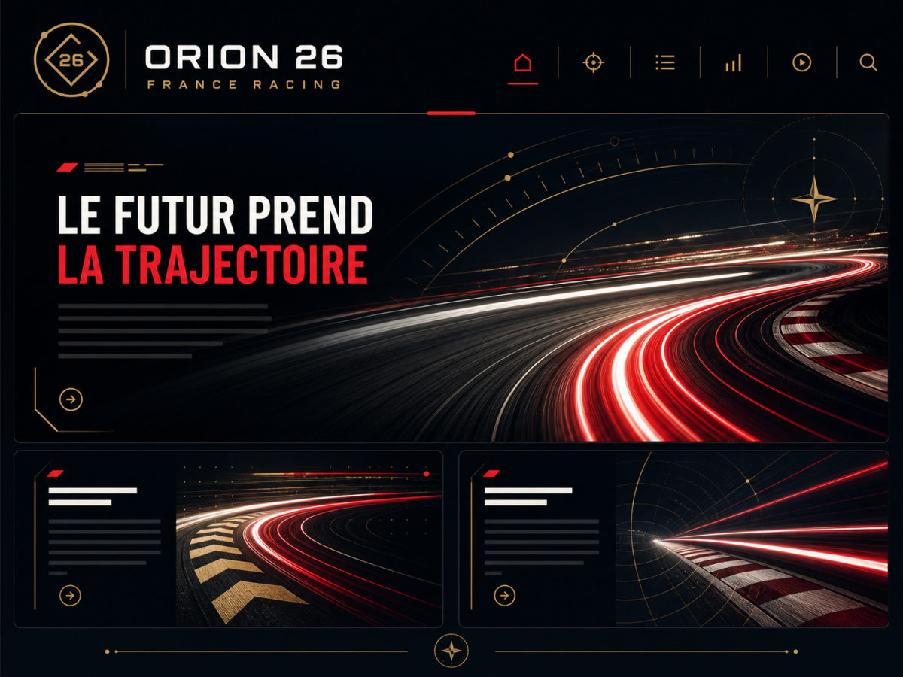

# Orion 26

Orion 26 est un thème WordPress éditorial moderne et responsive destiné aux sites d’actualité, magazines et médias indépendants. Il associe une homepage structurée, huit identités visuelles et un panneau de réglages natif sans dépendance obligatoire à ACF.

## Fonctionnalités

- homepage magazine avec Une, actualités récentes, rubriques prioritaires et sélections éditoriales ;
- pages d’article, catégorie, auteur, tag, recherche, archives et rubrique « autres actualités » ;
- huit presets : Minimal, Expressif, Éditorial, Contraste, Velocity, Cosmos, Monolith et Aurora ;
- modes clair et sombre avec logos distincts et préférence automatique ou imposée ;
- panneau **Orion** natif organisé en sous-menus, indépendant d’ACF ;
- couleurs, polices et styles détaillés pour H1, H2, H3, H4, H5 et H6 avec aperçu direct ;
- styles séparés pour les titres de cartes, les titres sur image et les titres de rubriques ;
- animation de zoom des miniatures activable et respectueuse de la réduction des mouvements ;
- Header configurable : logos, menu, disposition, hauteur, fonds, textes, typographie et comportement ;
- rubriques et comptes autorisés présentés sous forme de listes à cocher filtrables ;
- ouverture globale et sécurisée des liens externes dans un nouvel onglet ;
- six familles de polices auto-hébergées, sans dépendance à un CDN ;
- profils de rubrique avec présentation longue et liens officiels ou sociaux ;
- gestionnaire de consentement optionnel par catégories avec prise en charge de GPC ;
- gestion de WP Simple PWA et WP TurnSite façon Avada : versions GitHub, installation, activation, mise à jour et désinstallation ;
- SEO de repli avec `NewsArticle`, `ProfilePage`, `BreadcrumbList`, métadescriptions et règles robots ;
- compatibilité optionnelle avec un post type publicitaire `ad` et les marqueurs `sponso`, `cp` et `histo` ;
- interface traduite en français, anglais, italien, espagnol et portugais.

## Cas d’usage

Orion est particulièrement adapté pour :

- créer un média d’actualité à forte hiérarchie éditoriale ;
- décliner rapidement plusieurs identités graphiques sans thème enfant ;
- donner à une rédaction un contrôle précis de la homepage et des rubriques ;
- remplacer progressivement un thème historique grâce à une migration non destructive ;
- distribuer une base éditoriale réutilisable sans données propres au site d’origine.

## Installation

1. Télécharger `orion-26-3.6.0.zip` depuis la [dernière release](https://github.com/TheLibertyWolf/WP-Orion-template/releases/latest).
2. Dans WordPress, ouvrir **Apparence → Thèmes → Ajouter un thème → Téléverser**.
3. Installer puis activer **Orion 26**.
4. Ouvrir **Orion → Identité et apparence** et choisir un preset.
5. Configurer le menu et les logos dans **Orion → Header**.
6. Choisir les rubriques dans **Orion → Homepage et rubriques**.

Les réglages sont enregistrés dans l’option non autoloadée `orion26_settings`. Une migration intégrée reprend sans supprimer les anciennes valeurs Orion 26, Orion 26+ et les options AH19 compatibles.

## Captures d’écran

### Aperçu du thème

## Organisation des réglages

| Sous-menu | Réglages principaux |
|---|---|
| Identité et apparence | Preset, clair/sombre, largeur générale |
| Couleurs / typographies | Palette, corps de texte, H1–H6, citations et code |
| Navigation | Liens externes, lien final et breakpoint mobile |
| Homepage et rubriques | Une, blocs prioritaires, hub et rubriques secondaires |
| Réseaux sociaux | Profils sociaux et RSS |
| Consentement | Bandeau, catégories et scripts conditionnels |
| Accès aux réglages | Comptes autorisés, réservé aux administrateurs |
| Header | Logos, menu, disposition, couleurs, typographie et comportement |
| Footer | Logo, rubriques, colonnes, menu et copyright dynamique |
| Plugins recommandés | État, versions GitHub, installation, activation, mise à jour et désinstallation |
| À propos | Auteur, version, licence et dépôt GitHub |

La documentation détaillée se trouve dans [docs/SETTINGS.md](docs/SETTINGS.md), [docs/ARCHITECTURE.md](docs/ARCHITECTURE.md), [docs/CONSENT.md](docs/CONSENT.md) et [docs/MIGRATION.md](docs/MIGRATION.md).

## Sécurité

- chaque écriture est protégée par une nonce WordPress ;
- les droits sont revérifiés côté serveur pour chaque sous-menu ;
- seul un administrateur peut déléguer l’accès aux réglages ;
- les valeurs utilisent une validation adaptée à leur type et les sorties sont échappées ;
- les champs de scripts exigent l’aptitude `unfiltered_html` ;
- les liens externes reçoivent `noopener`, `noreferrer` et `external` ;
- les scripts de suivi peuvent rester bloqués jusqu’au consentement ;
- les paramètres d’un site réel, clés et contenus de suivi ne sont jamais inclus dans le dépôt.

Consultez [SECURITY.md](SECURITY.md) avant de signaler une vulnérabilité. Le gestionnaire de consentement est un outil technique et ne constitue pas un avis juridique.

## Compatibilité

- WordPress 6.5 ou version ultérieure ;
- testé sur WordPress 7.0.4 ;
- PHP 8.1 à PHP 8.4 ;
- installation WordPress simple ;
- SEOPress prioritaire lorsqu’il est actif ;
- ACF et Complianz facultatifs.

## Langues

Orion utilise automatiquement la langue de WordPress ou du profil utilisateur. Le français est la langue source.

| Langue | Locale WordPress | Couverture | État |
|---|---|---:|---|
| 🇫🇷 Français | `fr_FR` | 100 % | Langue source |
| 🇬🇧 Anglais | `en_US` | 100 % | Complet |
| 🇮🇹 Italien | `it_IT` | 100 % | Complet |
| 🇪🇸 Espagnol | `es_ES` | 100 % | Complet |
| 🇵🇹 Portugais | `pt_PT` | 100 % | Complet |

Les règles techniques de traduction sont détaillées dans [TRANSLATIONS.md](TRANSLATIONS.md).

## Contribution et support

- [Guide de contribution](CONTRIBUTING.md)
- [Support](SUPPORT.md)
- [Code de conduite](CODE_OF_CONDUCT.md)
- [Historique des versions](CHANGELOG.md)

## Auteur

SAS Jessy System — [https://jessysystem.com](https://jessysystem.com)

Développement public : [TheLibertyWolf/WP-Orion-template](https://github.com/TheLibertyWolf/WP-Orion-template)

## Licence

GPL-2.0-or-later. Voir [LICENSE](LICENSE).
